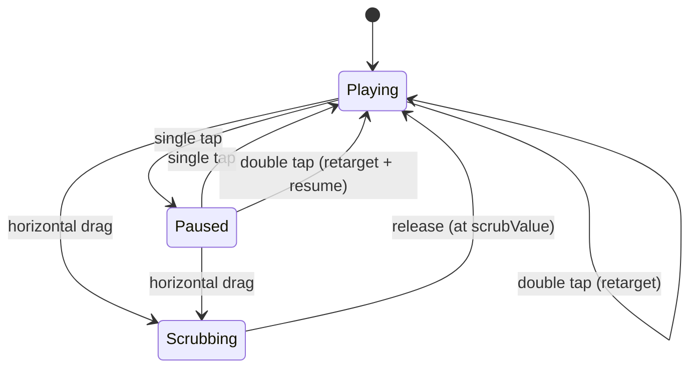

# Interaction Model

The behavioural bridge between the [requirements](../requirements/index.md) and the
build: the app's states, the gestures that move between them, and the rules that
govern playback. Low-fidelity by design — states and transitions, not pixels. This
is living context, so it carries no status badge.

## Two orthogonal axes

The app is described by two independent variables, not a set of distinct "modes":

- **Camera** — `front` or `back`. A small persistent on-screen button flips it.
  Determines mirroring (below). Switching camera resets the buffer and re-ramps.
- **Delay** — a continuum from `0` (live) to `240s`. **"Live" is not a mode; it is
  delay `0`, the forward edge of the buffer.** What you display is governed by a
  `targetOffset`, the home you are heading for.

Everything the user does is a move on one of these two axes. There is no separate
"Live mode" with its own suspend/resume — live is just `targetOffset = 0`.

### targetOffset

`targetOffset ∈ { live (0), base, scrubValue }`. The displayed `effectiveDelay`
ramps toward `targetOffset` rather than jumping (see Ramp). The playback state
machine (below) is purely the delay axis; the camera is a parallel toggle.

## States (delay axis)

- **Playing** — the loop plays forward at `effectiveDelay`, ramping toward
  `targetOffset`. The steady state.
- **Paused** — the current frame is held on screen. Capture never stops.
- **Scrubbing** — active during a horizontal drag; on release returns to Playing at
  the dragged position.

Two deliberate non-states:

- **No "Returning" state** — double-tap-home is an instant retarget into Playing.
- **No "Ramp/Filling" state** — the startup/camera-switch ramp is just Playing with
  `effectiveDelay < targetOffset`. The ramp lives in one place (the offset value).

## Gestures

| Gesture | Action |
|---------|--------|
| single tap | pause / resume |
| double tap | toggle base ↔ live (any other position → base) |
| horizontal drag | scrub within `[oldest, live]` |
| swipe up | open settings (delay wheel + presets) |
| camera button | flip front / back |

### Double-tap target rule

Double-tap snaps between the two home points and always resumes Playing:

1. at **live** (`0`) → go to **base**
2. at **base** → go to **live**
3. anywhere else (scrubbed / paused mid-buffer) → go to **base** (this is the
   FR-012 re-sync)

So: double-tap = "snap between the two homes; any off-home position resets to base
first." Horizontal drag handles fine positioning anywhere in the range; double-tap
handles the two quick homes. Scrubbing toward live still exists as the forward
bound, but it is no longer the primary way to reach live.

### Settings sheet

Swipe up opens a settings sheet with:

- **Delay** — a drum wheel that snaps to a uniform ladder: `live (0)` then `5s` steps
  up to `240s`. No numeric input (keyboard-hostile mid-workout); the wheel plus
  presets cover every value (FR-006).
- **Presets** — quick-select values (Gym 60s, Archery 30s), the primary fast path
  (FR-008).

The buffer window is not shown — it is derived (`delay + 60s`, capped at 300s). Front
mirroring is not a setting either; it is fixed by camera (see below).

## Behavioural rules

### Mirroring is a function of camera

Front camera is always mirrored (used as a mirror); back camera is never mirrored
(the observer's view from across the room). No setting — it is the physically
correct default in both cases.

### Per-camera defaults

Flipping to the **front** camera defaults to **live** (the prep/mirror use case);
the **back** camera defaults to **base** (the review use case). Each camera keeps
its own sensible home.

### The buffer always fills

Capture and encode run continuously regardless of `targetOffset` — even while at
live — so the moment you double-tap to base there is history to show (ramped if the
buffer is still filling, full once warmed). At live the raw frame is drawn straight
to the canvas for a zero-latency mirror, while encoding into the buffer continues in
parallel: a display path and a history path running together.

### Ramp (FR-004)

On startup, after a camera switch, or when the target delay exceeds the buffered
footage, `effectiveDelay` ramps from `0` up to `targetOffset` as the buffer fills;
the screen shows near-live until then.

### Pause at buffer capacity

The buffer is a fixed sliding window; pausing never grows it. While paused:

- The frozen image stays on screen — it is the last frame drawn to the canvas, so
  it persists no matter how long you pause.
- The paused position is a timestamp `T`. The displayed delay (`now − T`) keeps
  rising without bound while paused — it reports the true age of the frozen frame,
  even once that frame has evicted from the buffer.
- On resume, the cursor clamps to `oldestTime`: playback continues forward from your
  exact spot if `T` is still buffered, otherwise both the image and the delay jump
  to the oldest available frame (the deepest point still resumable).

A very long pause therefore lets the delay grow indefinitely against a frozen
picture, then snaps to the deepest available offset the moment you resume; memory
stays bounded throughout.

### Scrub bounds (FR-013)

Scrubbing cannot go earlier than the oldest buffered frame, nor later than live.

## Rationale

The decision to adopt this orthogonal model (over the original two-mode framing) and
the requirements it revised are recorded in
[ADR-0010](../decisions/0010-orthogonal-interaction-model.md).
